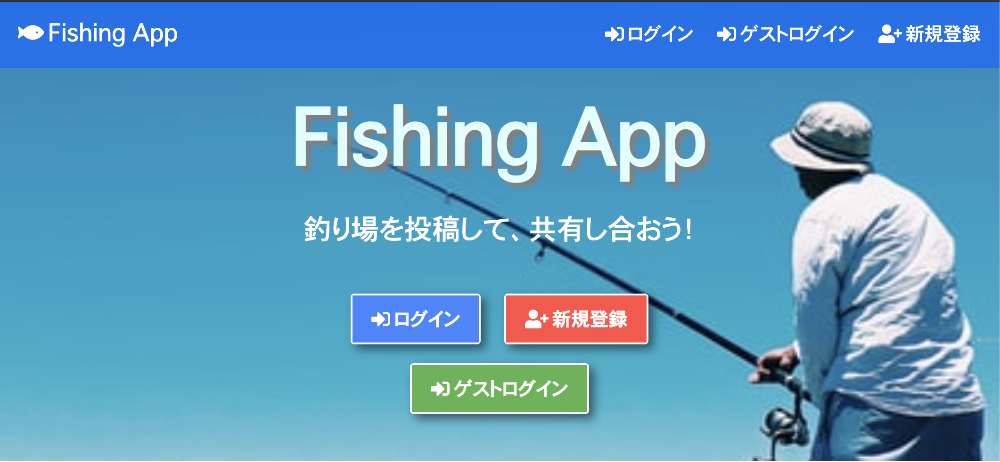
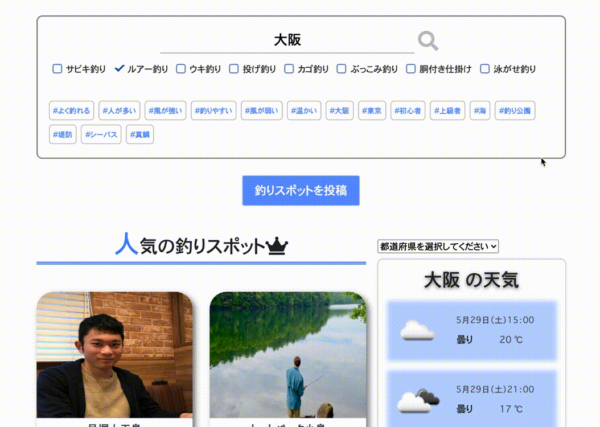
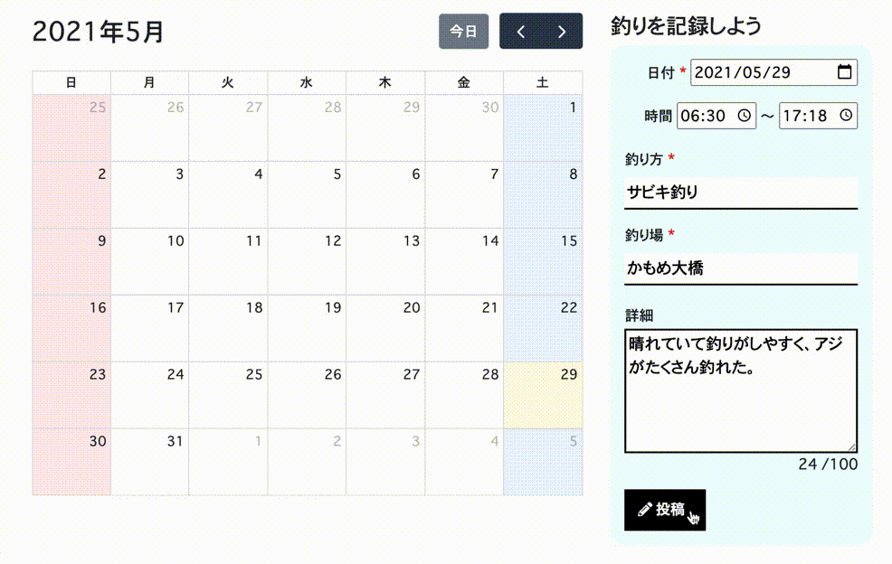
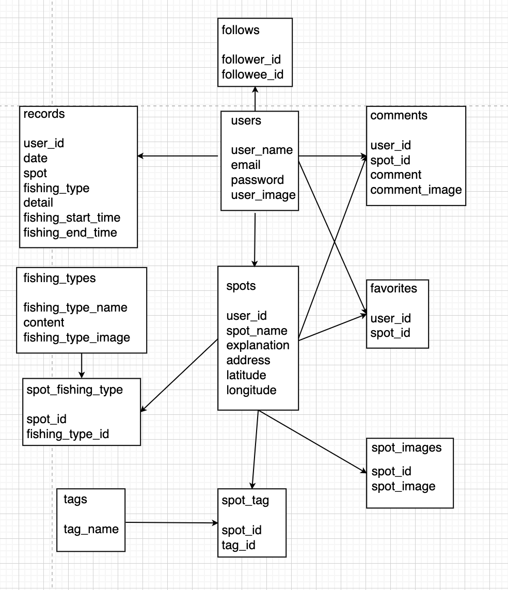

<h2>概要</h2>

Fishing App
URL：

Fishing Appとは、釣りスポットを投稿し、釣りスポットにコメントして釣果などを共有するアプリです。また、釣りスポットにおすすめの釣り方を選択することもできます。さらに、カレンダーで釣りの予定、記録をすることができ、このアプリ１つで満足できます。

<h3>制作背景</h3>
現在は釣りの技術が発展しており、釣りを始める人が日々増加しています。しかし、初心者の場合、どこで釣りができるかわからないという方々がほとんどだと思います。そこで、釣りスポットを投稿し、このアプリを通して全国の様々な釣りスポットを紹介してほしいと考えました。また、釣果などを共有し合って、より多くの人方々に釣りの知識を深めてほしいと思います。
さらに、釣りスポットや釣り方だけでなく、釣りは天気、道具などチェックすることが多いので、カレンダーに釣りの予定等を入れて忘れないで欲しいためにも、このサービスを開発しようと思いました。

<h3>工夫した点</h3>

* Laravel、Vue.jsを用いた完全SPA
* AWS(ECS)、Docker、Github Actionsの導入
* GoogleMapで釣りスポットを表示、OpenWeatherMapで天気予報を表示
* 残り文字数の表示など細かい部分も実装
* 個人的な「経験」による釣りスポットや釣り方の的確な説明

<h2>使用技術</h2>

* HTML / CSS
* Javascript(Vue.js)
* Bootstrap
* PHP 7.3
* Laravel 8.29.0
* MySQL 8.0.23
* AWS(ECS, Fargate VPC, Route53, S3)
* Docker/docker-compose
* Nginx
* PHPUnit
* VScode

<h2>機能一覧</h2>

<h3>ユーザー機能</h3>

* ユーザーの新規登録
* プロフィール画像の追加
* ユーザー情報の編集
* （ゲストユーザー）ゲストログイン

<h3>フォロー機能</h3>

* ユーザーをフォロー、フォロー解除
* フォロー、フォロワー表示

<h3>釣りスポット一覧</h3>

* 人気の釣りスポット一覧
* フォローしたユーザーの釣りスポット一覧
* 新しい順に投稿された釣りスポット一覧

<h3>釣りスポット投稿機能</h3>

* googlemapで釣りスポットの位置表示
* 関連する釣り方、タグも追加可能
* 画像複数選択可能（３つまで）

<h3>天気予報機能</h3>

* 釣りで重要な天気予報を表示（全国の天気を選択可能）

<h3>お気に入り機能</h3>

* 釣りスポットのお気に入り登録
* 釣りスポットのお気に入り解除
* お気に入りした釣りスポットの一覧

<h3>検索機能</h3>

* 釣りスポット名や所在地、関連する釣り方をキーワードに検索
* 関連するタグから検索
* 検索した釣りスポットの一覧

<h3>コメント機能</h3>

* 釣りスポットコメントの新規投稿（画像付き）
* 釣りスポットコメントの削除
* コメントの一覧

<h3>釣り方機能</h3>

* 釣り方名とその内容、画像表示
* その釣り方におすすめな釣りスポットを表示

<h3>カレンダー機能</h3>

* 釣りの予定・記録を作成、編集、削除
* 釣りの予定・記録をカレンダーに表示
* 釣りの予定・記録の日付は移動可能

<h3>テスト機能</h3>

+ PHPUnitによるテスト(Tests: 86)

<h2>懸念、気になっている点</h2>

* デザインがシンプルすぎるか
* ページネーションが少し質素
* safariだと天気予報APIがうまく読み込まれない、UIが多少崩れる。
* 釣り方（仕掛け）のフリー画像がなさすぎて大苦戦。現在の画像では不服。

<h2>インフラ構成図</h2>

<h2>ER図</h2>

 
