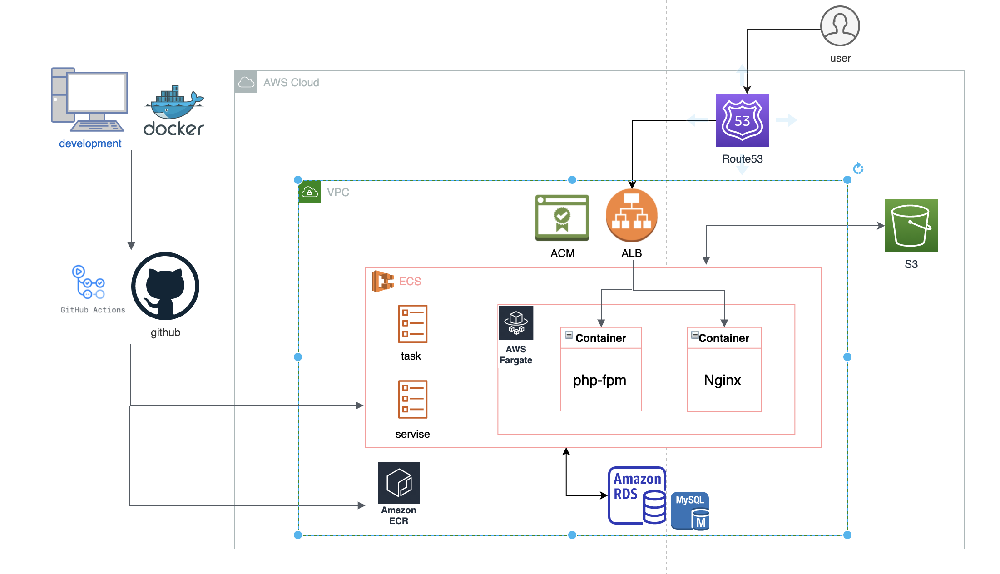

<h2>概要</h2>

Fishing App
URL：https://fishing-spot.herokuapp.com/　　(現在 Heroku でデプロイ中)

Fishing App とは、釣りスポットを投稿し、釣りスポットにコメントして釣果などを共有するアプリです。また、釣りスポットにおすすめの釣り方を選択することもできます。さらに、カレンダーで釣りの予定、記録をすることができるので、このアプリ１つで満足できます。

<h3>制作背景</h3>
<h4>１，今まで釣行した釣り場を共有したいため</h4>
何度も釣行して釣りに慣れてくると、今まで釣行した釣り場を誰かに知ってもらいたい、共有したいという思いが出てきます。その思いに応えるため、このサービスを開発しようと思いました。
<h4>2，釣りの知見を広めてほしいため</h4>
現在は釣りの技術が発展しており、釣りを始める人が日々増加しています。しかし、初心者の場合、どこで釣りができるかわからない、どんな釣り方があるのかわからないという方々がほとんどだと思います。そこで、釣りスポットを投稿し、このアプリを通して全国の様々な釣りスポットを紹介してほしいと考えました。また、その釣りスポットに最適な釣り方を知り、釣果などを共有し合って、より多くの人方々に釣りの知識を深めてほしいと思います。
<h4>3，釣りを予定、記録できるように</h4>
釣行前には天気、道具などのチェックをすることが多く、1度行った釣り場は今後のために特徴を覚えることも多いです。そのため、釣りスポットを投稿したり、カレンダーに釣りの予定や記録を入れて覚えやすくするためにも、このサービスを開発しようと思いました。

<h3>工夫した点</h3>

-   SSL 化
-   Laravel、Vue.js を用いた完全 SPA
-   AWS(ECS)、Docker、Github Actions の導入
-   個人的な「経験」による釣りスポットや釣り方の的確な説明
-   GoogleMap で釣りスポットの位置を表示、OpenWeatherMap で天気予報を表示
-   初学者なりにリファクタリングを重視（Fat Controller や Fat Model にならないように）

<h2>使用技術</h2>

-   HTML / CSS
-   Javascript(Vue.js)
-   Bootstrap
-   PHP 7.3
-   Laravel 8.29.0
-   MySQL 8.0.23
-   AWS(ECS, Fargate VPC, Route53, S3)
-   Github Actions
-   Docker/docker-compose
-   Nginx
-   PHPUnit
-   VScode

<h2>機能一覧</h2>

<h3>ユーザー機能</h3>

-   ユーザーの新規登録
-   プロフィール画像の追加
-   ユーザー情報の編集
-   （ゲストユーザー）ゲストログイン

<h3>フォロー機能</h3>

-   ユーザーをフォロー、フォロー解除
-   フォロー、フォロワー表示

<h3>釣りスポット一覧</h3>

-   人気の釣りスポット一覧
-   フォローしたユーザーの釣りスポット一覧
-   新しい順に投稿された釣りスポット一覧

<h3>釣りスポット投稿機能</h3>

-   googlemap で釣りスポットの位置表示
-   関連する釣り方、タグも追加可能
-   画像複数選択可能（３つまで）

<h3>天気予報機能</h3>

-   釣りで重要な天気予報を表示（全国の天気を選択可能）

<h3>お気に入り機能</h3>

-   釣りスポットのお気に入り登録
-   釣りスポットのお気に入り解除
-   お気に入りした釣りスポットの一覧

<h3>検索機能</h3>

-   釣りスポット名や所在地、関連する釣り方をキーワードに検索
-   関連するタグから検索
-   検索した釣りスポットの一覧

<h3>コメント機能</h3>

-   釣りスポットコメントの新規投稿（画像付き）
-   釣りスポットコメントの削除
-   コメント一覧

<h3>釣り方機能</h3>

-   釣り方名とその内容、画像表示
-   その釣り方におすすめな釣りスポットを表示

<h3>カレンダー機能</h3>

-   釣りの予定・記録を作成、編集、削除
-   釣りの予定・記録をカレンダーに表示
-   釣りの予定・記録の日付は移動可能

<h3>テスト機能</h3>

-   PHPUnit によるテスト(Tests: 86)

<h2>懸念、気になっている点</h2>

-   リファクタリングが不十分か
-   ページネーションが少し質素
-   safari だと天気予報 API がうまく読み込まれない、UI が多少崩れる。
-   釣り方（仕掛け）のフリー画像がなさすぎて大苦戦。現在の画像では不服。

<h2>インフラ構成図</h2>

 

<h2>ER図</h2>

 
